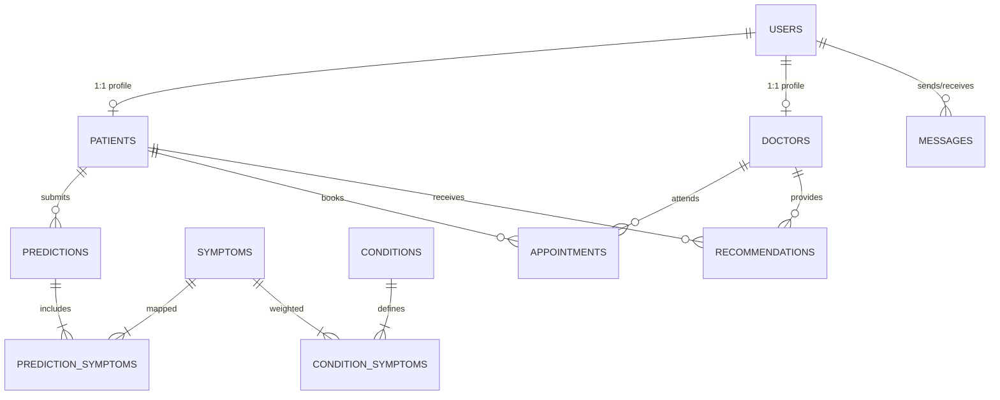

# MediPredict – Smart Medical Condition Prediction & Doctor Consultation System

> **"Understand Your Symptoms. Take the Right Next Step."**

MediPredict is a full-featured Java healthcare desktop application designed to bridge the gap between preliminary symptom awareness and professional clinical consultation. It features an explainable symptom-condition prediction engine, secure role-based authentication with salted SHA-256 password hashing, appointment management with duplicate slot prevention, clinical doctor recommendations, and encrypted patient-physician messaging.

---

## 🌟 Key Features

### 1. Patient Portal
- **Interactive Symptom Analyzer**: Searchable, multi-category symptom catalog with interactive tag chips.
- **Explainable Condition Prediction**: Multi-factor scoring engine calculating match percentage ($CMI$), confidence rating (High/Medium/Low), risk severity assessment, and differential diagnoses.
- **Historic Health Timeline**: Filterable prediction history table with full retrospective details.
- **Doctor Consultation Directory**: Search physicians by name, medical specialty, hospital, or experience.
- **Appointment Booking**: Schedule consultations with automated slot collision prevention.
- **Doctor Care Advice**: Receive clinical recommendations, dietary guidance, and scheduled follow-ups.
- **Consultation Messaging**: Database-backed chat system with unread badges.
- **Health Profile Management**: Manage personal contact details, medical history, blood group, emergency contact, and security credentials.

### 2. Doctor Portal
- **Clinical Dashboard**: Real-time stats on today's scheduled appointments, pending consultation requests, active patient count, and unread inquiries.
- **Appointment Management**: Review, confirm, reschedule, or mark consultations as completed.
- **Patient Records & History**: Search patient files, review underlying medical conditions, and inspect previous symptom prediction logs.
- **Personalized Medical Recommendations**: Issue clinical advice, lifestyle guidelines, and follow-up dates linked directly to patient profiles.
- **Direct Patient Chat**: Communicate securely with consulting patients.
- **Practice Profile**: Configure hospital affiliations, consultation fees, bio, and availability hours.

### 3. Non-Diagnostic Medical Disclaimer Banner
> ⚠️ **Notice**: *MediPredict provides preliminary symptom-based information for educational and informational purposes only. It does not provide a medical diagnosis or replace professional medical advice. Please consult a qualified healthcare professional for proper evaluation and treatment.*

---

## 🏗️ System Architecture & Layered Design

MediPredict strictly adheres to the **Layered Architecture / Data Access Object (DAO) Pattern**:

```
MediPredict/
├── lib/                             # Standalone JAR Dependencies
│   ├── flatlaf-3.5.4.jar            # Modern UI Look & Feel
│   ├── sqlite-jdbc-3.47.1.0.jar     # Embedded SQLite Driver (Zero-Config)
│   └── mysql-connector-j-9.2.0.jar  # Enterprise MySQL Driver
│
├── src/
│   └── com/medipredict/
│       ├── Main.java                # Application Entrypoint
│       ├── IntegrationTest.java     # Headless 23-Point Automated Test Suite
│       │
│       ├── model/                   # Domain Model Entities (Encapsulation)
│       │   ├── Role.java            # PATIENT / DOCTOR Enum
│       │   ├── User.java            # Base User Account
│       │   ├── Patient.java         # Patient Profile (Inheritance)
│       │   ├── Doctor.java          # Doctor Profile (Inheritance)
│       │   ├── Symptom.java         # Medical Symptom Definition
│       │   ├── MedicalCondition.java# Disease & Condition Definition
│       │   ├── Prediction.java      # Prediction Record
│       │   ├── Appointment.java     # Consultation Booking Record
│       │   ├── Recommendation.java  # Doctor Clinical Advice
│       │   ├── Message.java         # Patient-Doctor Message
│       │   └── PredictionResultData.java # Prediction Payload DTO
│       │
│       ├── dao/                     # Data Access Objects (PreparedStatements)
│       │   ├── UserDAO.java
│       │   ├── PatientDAO.java
│       │   ├── DoctorDAO.java
│       │   ├── SymptomDAO.java
│       │   ├── ConditionDAO.java
│       │   ├── PredictionDAO.java
│       │   ├── AppointmentDAO.java
│       │   ├── RecommendationDAO.java
│       │   └── MessageDAO.java
│       │
│       ├── service/                 # Business Logic & Validation Layer
│       │   ├── AuthService.java
│       │   ├── PatientService.java
│       │   ├── DoctorService.java
│       │   ├── PredictionService.java
│       │   ├── AppointmentService.java
│       │   ├── RecommendationService.java
│       │   ├── MessageService.java
│       │   └── SessionManager.java   # Thread-Safe User Session Singleton
│       │
│       ├── database/                # Persistence & Connection Management
│       │   ├── DatabaseConfig.java
│       │   ├── DatabaseConnection.java
│       │   ├── DatabaseInitializer.java
│       │   └── SampleDataLoader.java
│       │
│       ├── prediction/              # Condition Matching & Heuristics
│       │   ├── ConditionKnowledgeBase.java
│       │   ├── SymptomMatcher.java
│       │   ├── MatchResult.java
│       │   └── PredictionEngine.java
│       │
│       ├── ui/                      # Graphical User Interface (FlatLaf Swing)
│       │   ├── MainFrame.java
│       │   ├── NavigationManager.java
│       │   ├── components/          # Reusable UI Widgets
│       │   │   ├── ModernCard.java, StatCard.java, ModernButton.java
│       │   │   ├── ModernTextField.java, ModernPasswordField.java
│       │   │   ├── ModernComboBox.java, ModernTable.java
│       │   │   ├── SymptomTagChip.java, ChatBubblePanel.java
│       │   │   ├── ToastNotification.java, HeaderPanel.java, SidebarPanel.java
│       │   ├── screens/             # Modular Full-Screen Views
│       │   │   ├── LandingScreen.java, LoginScreen.java, RegisterScreen.java
│       │   │   ├── ForgotPasswordScreen.java, PatientDashboardScreen.java
│       │   │   ├── DoctorDashboardScreen.java, SymptomPredictionScreen.java
│       │   │   ├── PredictionResultScreen.java, PredictionHistoryScreen.java
│       │   │   ├── DoctorDirectoryScreen.java, AppointmentBookingScreen.java
│       │   │   ├── PatientAppointmentsScreen.java, DoctorAppointmentsScreen.java
│       │   │   ├── DoctorPatientsScreen.java, DoctorRecommendationsScreen.java
│       │   │   ├── PatientRecommendationsScreen.java, PatientProfileScreen.java
│       │   │   ├── DoctorProfileScreen.java, MessagingScreen.java
│       │   └── theme/               # Palettes & Styling Tokens
│       │       ├── ThemeColors.java
│       │       ├── ThemeFonts.java
│       │       └── UIUtils.java
│       │
│       └── util/                    # Utility Functions
│           ├── PasswordUtil.java    # Salted SHA-256 Cryptographic Hashing
│           ├── ValidationUtil.java  # Regex & Field Validator
│           ├── DateTimeUtil.java    # Thread-Safe Date & Age Calculators
│           └── Logger.java          # Formatted Console & Error Logger
│
├── database/                        # SQL Scripts
│   └── medipredict.sql              # MySQL DDL & DML Script
├── resources/
│   └── db.properties                # Dual Database Config Switch
├── pom.xml                          # Maven Configuration
├── compile.bat / compile.ps1        # 1-Click Compilation Scripts
├── run.bat / run.ps1                # 1-Click Launch Scripts
└── test.bat / test.ps1              # 1-Click Test Runner Scripts
```

---

## 🗄️ Relational Database Schema (10 Normalized Tables)



### Table Reference:
1. `users`: Credentials, full name, phone, role (`PATIENT`/`DOCTOR`), salted SHA-256 hash.
2. `patients`: Date of birth, gender, blood group, medical history/allergies, emergency contact.
3. `doctors`: Specialization, hospital/clinic, experience years, consultation fee, bio, availability hours.
4. `symptoms`: 27+ pre-seeded symptoms (category, description, severity weight).
5. `conditions`: 12+ pre-seeded conditions (category, description, self-care precautions, severity level).
6. `condition_symptoms`: Weighted symptom linkages for condition scoring (Primary = 3, Secondary = 1).
7. `predictions`: Past predictions (match score %, confidence rating, risk severity, clinical notes, timestamp).
8. `prediction_symptoms`: Many-to-many relationship tracking symptoms submitted per prediction.
9. `appointments`: Date, time slot, reason, notes, status (`PENDING`, `CONFIRMED`, `COMPLETED`, `CANCELLED`).
10. `recommendations`: Clinical suggestions, lifestyle/diet advice, follow-up date, doctor notes.
11. `messages`: Encrypted consultation messages, timestamps, and read receipts.

---

## ⚙️ Prediction Engine Algorithm & Scoring Formulation

The prediction engine implements a **multi-factor weighted scoring model**:

$$\text{Match Ratio (Recall)} = \frac{\sum_{s \in (S_{input} \cap S_c)} w_s}{\sum_{s \in S_c} w_s}$$

$$\text{Coverage (Precision)} = \frac{|S_{input} \cap S_c|}{|S_{input}|}$$

$$\text{Composite Condition Match Index } (CMI) = (0.70 \times \text{Recall} + 0.30 \times \text{Precision}) \times 100\%$$

- **Confidence Rating**:
  - $CMI \ge 70.0\% \implies \text{\textbf{High Confidence}}$
  - $40.0\% \le CMI < 70.0\% \implies \text{\textbf{Medium Confidence}}$
  - $CMI < 40.0\% \implies \text{\textbf{Low / Inconclusive Match}}$
- **Differential Diagnoses**: The system ranks all other matching conditions and presents the top 3 alternative candidate diseases with lower correlation percentages.
- **Risk Severity**: Evaluated based on condition severity and maximum symptom severity weights.

---

## 🚀 How to Run the Application

### Option 1: 1-Click Launch (Zero Configuration with Embedded SQLite)
The application comes pre-configured with **Embedded SQLite** and all necessary JAR files inside `lib/`. No database installation or Maven is required!

1. Open PowerShell or Command Prompt in the project folder.
2. Run:
   ```cmd
   run.bat
   ```
   *or in PowerShell:*
   ```powershell
   .\run.ps1
   ```
3. The database (`medipredict.db`) and all sample data will be initialized automatically on the first launch!

### Option 2: Running with MySQL Database (Enterprise Mode)
1. Open MySQL Command Line or Workbench.
2. Execute the script:
   ```sql
   SOURCE database/medipredict.sql;
   ```
3. Open `resources/db.properties` and change:
   ```properties
   db.type=mysql
   mysql.username=root
   mysql.password=your_mysql_password
   ```
4. Run `run.bat` or `run.ps1`.

### Option 3: Importing into IDEs (IntelliJ IDEA / Eclipse / VS Code / NetBeans)
- **IntelliJ IDEA**: Click `File -> Open` -> Select `java proj` folder. If prompted, import as Maven project or configure `lib/*.jar` as project libraries. Run `com.medipredict.Main`.
- **Eclipse**: Click `File -> Import -> Existing Maven Project` or create a Java Project and add the JARs from `lib/` to the Build Path.
- **VS Code**: Open folder in VS Code with Java Extension Pack, and click `Run` on `Main.java`.

---

## 👥 Sample Login Credentials (For Viva & Presentation)

| Role | Email | Password | Full Name & Details |
| :--- | :--- | :--- | :--- |
| **Patient** | `patient@medipredict.com` | `patient123` | **Sarvesh Kumar** (Male, 24, Blood: O+) |
| **Patient** | `emma@medipredict.com` | `patient123` | **Emma Watson** (Female, 28, Blood: A+) |
| **Doctor** | `doctor@medipredict.com` | `doctor123` | **Dr. Emily Watson, MD** (General Physician - City Care Hospital) |
| **Doctor** | `chen@medipredict.com` | `doctor123` | **Dr. Robert Chen, MD** (Neurologist - Metro Neurology Center) |
| **Doctor** | `sharma@medipredict.com` | `doctor123` | **Dr. Priya Sharma, MD** (Pulmonologist - Apollo Health) |
| **Doctor** | `wilson@medipredict.com` | `doctor123` | **Dr. James Wilson, MD** (Gastroenterologist - St. Jude Care) |
| **Doctor** | `martinez@medipredict.com` | `doctor123` | **Dr. Linda Martinez, MD** (Cardiologist - Heart Pavilion) |

> 💡 *Tip: The Login screen includes one-click demo buttons ("Patient" & "Doctor") for instant demonstration during college evaluations!*

---

## 🧪 Automated Integration Testing

To run the complete 23-point headless test suite:
```cmd
test.bat
```
*or in PowerShell:*
```powershell
.\test.ps1
```

**Test Coverage Highlights:**
- Database schema creation & automatic sample seeding.
- Password hashing & salt security verification.
- Role-based login protection (prevents patient logging into doctor portal).
- Duplicate email registration prevention.
- Prediction engine mathematical accuracy (e.g. Headache + Nausea + Light Sensitivity $\to$ Migraine).
- Slot conflict prevention (double booking guard for same doctor, date, and time).
- Doctor recommendation creation and patient retrieval.
- Patient-Doctor direct message exchange.
- Profile CRUD persistence.

---

## 🎓 College Project Viva & Viva Q&A Guide

### Q1: What design patterns and architectural concepts are used?
- **Layered MVC/DAO Architecture**: Segregates presentation (`ui`), business logic (`service`), data persistence (`dao`), and domain entities (`model`).
- **Singleton Pattern**: Used in `SessionManager` to provide a thread-safe context for active authenticated users.
- **DTO Pattern (Data Transfer Object)**: `PredictionResultData` encapsulates analytical output, differential diagnoses, and precautions.
- **Inheritance & Polymorphism**: `Patient` and `Doctor` inherit from base `User` class.

### Q2: How is security handled in MediPredict?
- **Salted SHA-256 Hashing**: Passwords are never stored in plain text. Each account has a cryptographically random salt generated via `SecureRandom`.
- **SQL Injection Immunity**: 100% of database queries use JDBC `PreparedStatement` with parameterized queries.
- **Role-Based Screen Guards**: Patient screens cannot be accessed by doctor accounts and vice-versa.

### Q3: How does the symptom prediction system work?
- The system uses a weighted multi-symptom matching heuristic (`SymptomMatcher`) that evaluates primary and secondary symptom weights, penalizes unrelated symptoms, calculates confidence percentages, detects differential conditions, and assesses overall health risk level.

---

## 📄 License & Attribution
Developed as an academic Java healthcare project. All medical data is structured for educational and informational demonstrations.
